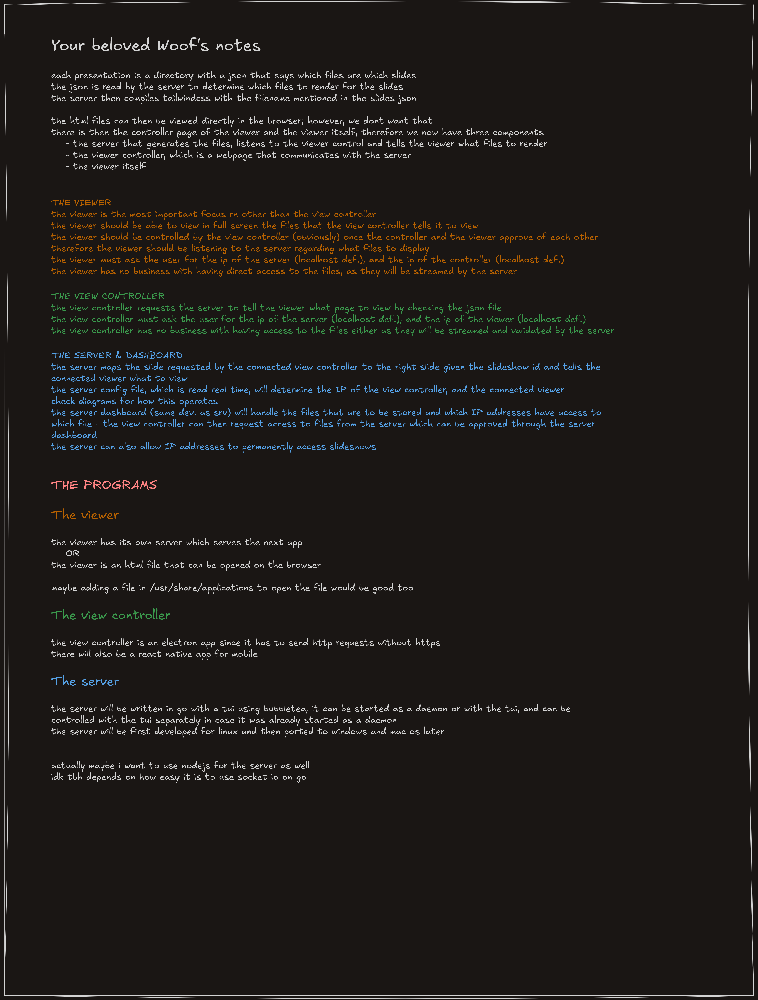
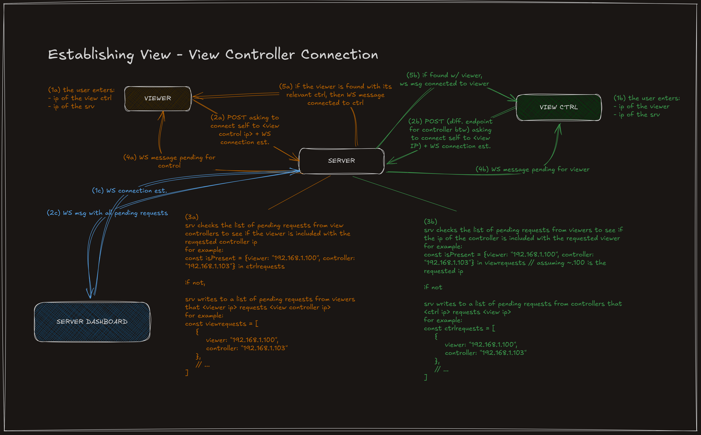
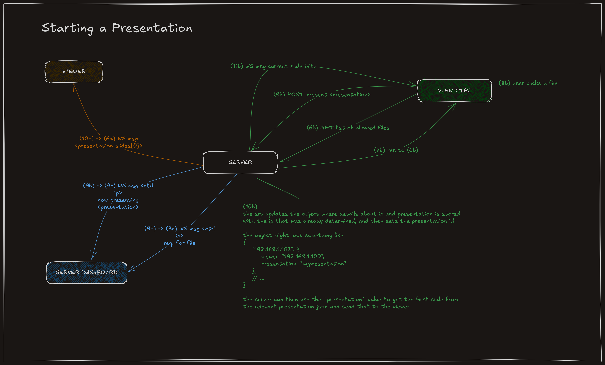
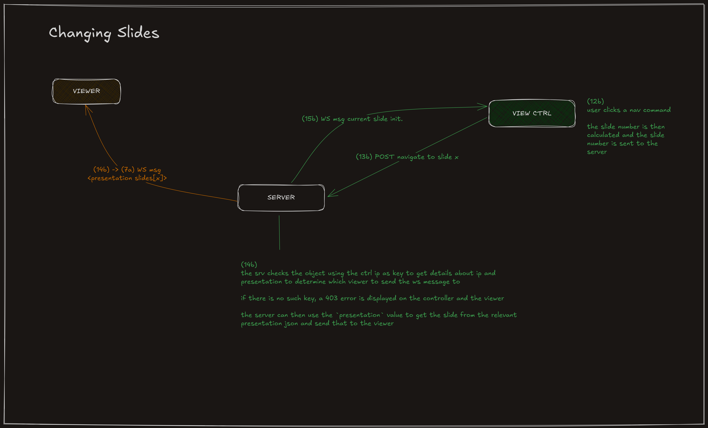

# Woofslides

Woofslides is a presentation system where each slide is an HTML page (styled with tailwindcss), and the viewer can be controlled from any device on the local network - allowing you to control the presentation on your phone.

This project is still a concept and here you can see the concept updated as often as I make updates.

